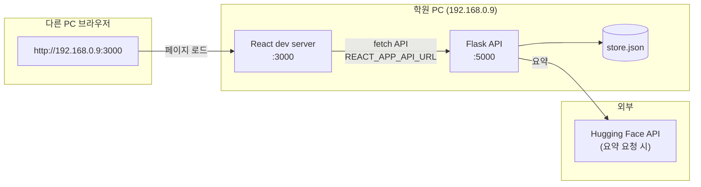

# MeCa 아키텍처

학원 PC에서 Flask·React 개발 서버만 띄우고, 같은 네트워크의 다른 PC는 **LAN IP `192.168.0.9`** 로 접속하는 구성을 기준으로 합니다. DB 연동은 추후 단계이며, 스키마·데이터는 **DBeaver**로 준비할 예정입니다.

## 1. 현재 구성 (요약)

| 구분 | 기술 | 비고 |
|------|------|------|
| 프론트엔드 | React (CRA), `0.0.0.0:3000` | `REACT_APP_API_URL`로 API 베이스 지정 |
| 백엔드 | Flask REST, `0.0.0.0:5000`, JWT, CORS | `back-end/app.py` |
| 저장소 | JSON `back-end/data/store.json` | **`store.py`** — DB 전환 전 단계 |
| 요약 | Hugging Face Inference API | `HF_TOKEN`, `hf_client.py` |
| 버전 관리 | Git | — |

## 2. 런타임 흐름 (다이어그램)

- 다른 사람 PC에서는 **프론트 주소**: `http://192.168.0.9:3000`
- 브라우저가 호출하는 API는 **`frontend/.env`의 `REACT_APP_API_URL`** → 학원 PC에서는 `http://192.168.0.9:5000` 권장 (같은 PC만 쓸 때는 `http://localhost:5000` 도 가능)

## 3. LAN 접속 체크리스트

1. 학원 PC 방화벽에서 TCP **3000**, **5000** 인바운드 허용
2. `back-end/.env`: `FLASK_HOST=0.0.0.0`, `FLASK_PORT=5000` (기본과 동일)
3. `frontend/.env`: `REACT_APP_API_URL=http://192.168.0.9:5000`
4. `.\run-dev.ps1` 실행 후, 다른 PC 브라우저에서 `http://192.168.0.9:3000` 접속
5. 학원 PC IP가 `192.168.0.9`가 아니면 위 IP를 실제 IP로 바꿈

## 4. 저장소: 지금과 나중

**지금:** 애플리케이션 데이터는 `store.py`가 `store.json`에 읽기/쓰기합니다. DB 연동 코드는 넣지 않은 상태로 두어도 됩니다.

**나중 (천천히):**

- **MariaDB** 등으로 옮길 때 스키마·초기 데이터는 **DBeaver**에서 생성·관리
- 애플리케이션 쪽에서는 `store.py`를 DB 어댑터로 교체하거나, `db.py` + ORM/쿼리 레이어를 추가하는 식으로 단계적 전환
- 연결 정보(호스트, 포트, DB명, 사용자)는 `back-end/.env`에 두고 Git에는 올리지 않기

## 5. 주요 소스 위치

| 경로 | 역할 |
|------|------|
| `back-end/app.py` | 라우트, JWT, 메모·인증 API |
| `back-end/store.py` | JSON 영속화 |
| `back-end/hf_client.py` | HF 요약 |
| `frontend/src/api.js` | `REACT_APP_API_URL` 기준 `fetch` |
| `frontend/src/App.js`, `components/*` | UI |

## 6. API 개요 (참고)

- `POST /api/auth/register`, `POST /api/auth/login`, `GET /api/auth/me`
- `GET /api/memos`, `POST /api/memos`, `GET|PATCH|DELETE /api/memos/<id>`
- `POST /api/memos/<id>/summarize`

---

*IP·포트·도구(DBeaver)는 팀 환경에 맞게만 조정하면 됩니다.*
